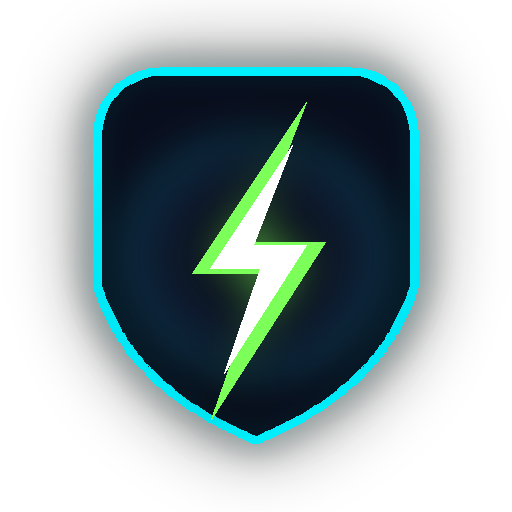
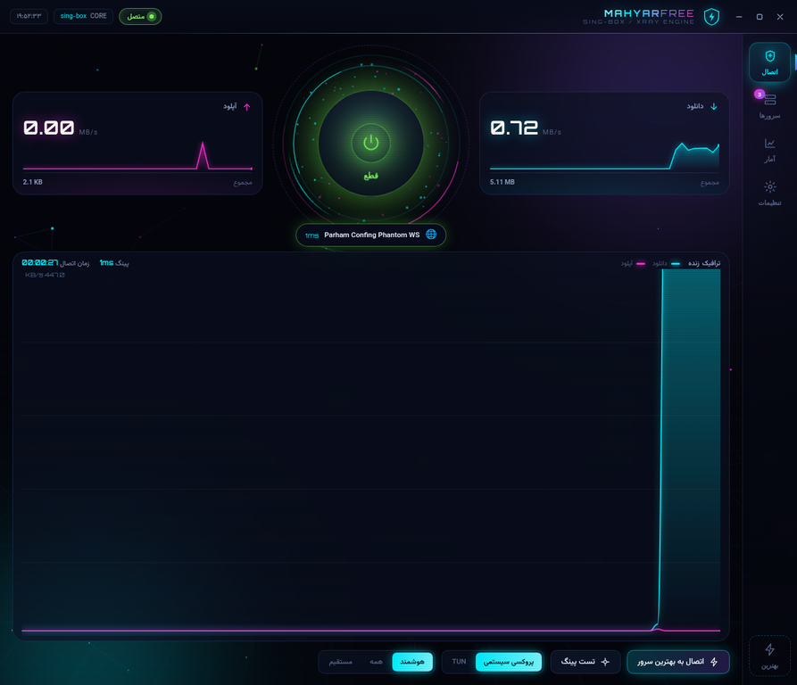
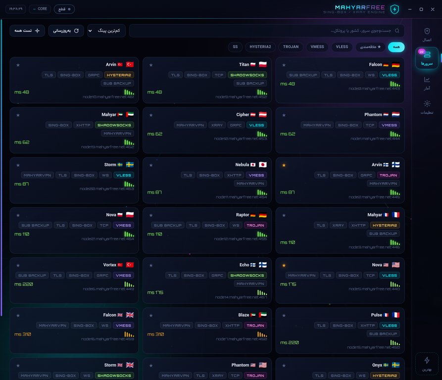
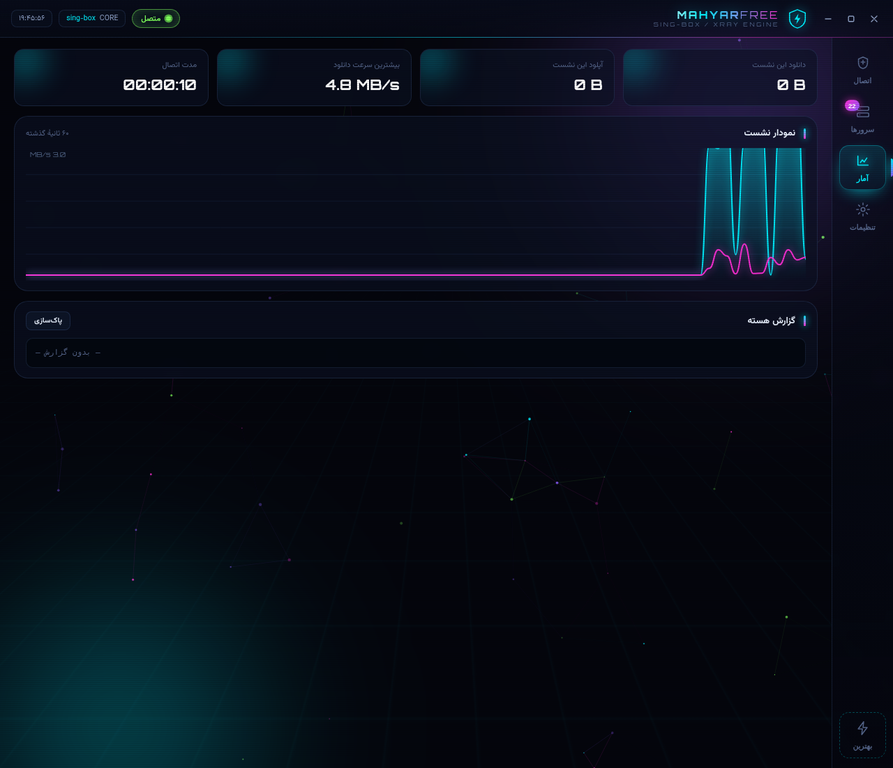
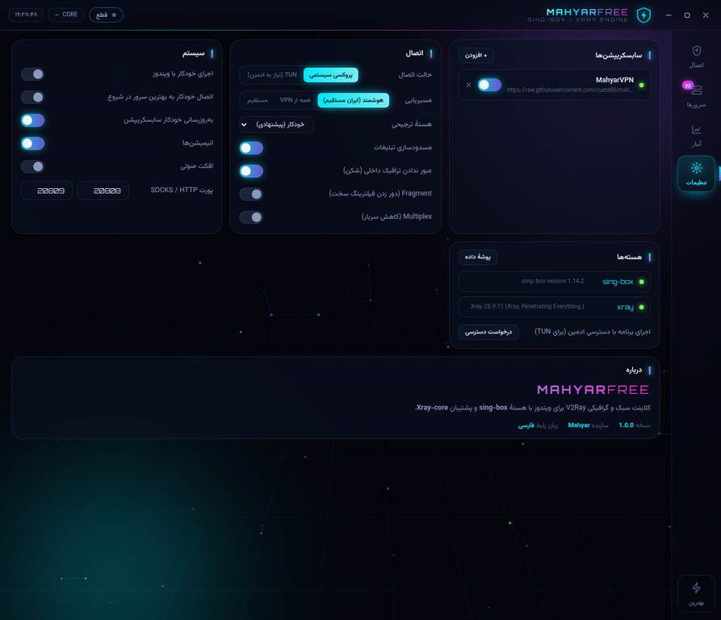

# 🦅 MahyarFree

**کلاینت VPN گرافیکی و سبک برای ویندوز، با هستهٔ `sing-box` و پشتیبان `Xray-core`.**

یک برنامهٔ کامل V2Ray/VLESS/VMess/Trojan/Hysteria2 با ظاهری نئون-گیمینگ، انیمیشن‌های روان، اتصال خودکار به بهترین سرور و انتخاب دستی از بین همهٔ سرورهای سابسکریپشن.

<p align="center">
  
</p>

---

## 📸 تصاویر

| صفحهٔ اتصال (متصل) | صفحهٔ سرورها |
|---|---|
|  |  |

| آمار | تنظیمات |
|---|---|
|  |  |

---

## ✨ قابلیت‌ها

### اتصال
- **اتصال به بهترین سرور** — روی هر کانفیگ یک هستهٔ موقت و مستقل بالا می‌آید و یک درخواست واقعی HTTPS از داخل تونل ارسال می‌شود؛ سپس فقط سرورهایی که پاسخ واقعی داده‌اند برای اتصال انتخاب می‌شوند. کانفیگی که فقط پورتش باز است ولی ترافیک نمی‌گذراند، سالم نشان داده نمی‌شود.
- **اتصال دستی** — روی هر کارت سرور کلیک کنید تا فوراً به آن وصل شوید.
- **دو حالت اتصال**
  - `پروکسی سیستمی` — بدون نیاز به ادمین؛ پروکسی ویندوز را خودکار تنظیم و در زمان قطع، حالت قبلی را برمی‌گرداند.
  - `TUN` — تونل کامل سطح سیستم (نیاز به دسترسی ادمین، دکمهٔ درخواست دسترسی در تنظیمات).
- **سه حالت مسیریابی**
  - `هوشمند` — سایت‌های ایرانی، بانک‌ها، درگاه‌های پرداخت و شبکهٔ داخلی مستقیم؛ بقیه از VPN.
  - `همه` — کل ترافیک از VPN.
  - `مستقیم` — بدون تونل (برای تست).
- **مسدودسازی تبلیغات و ردیاب‌ها** به‌صورت داخلی (بدون نیاز به دانلود لیست).

### سرورها
- پشتیبانی از پروتکل‌ها: **VLESS، VMess، Trojan، Shadowsocks، ShadowsocksR، Hysteria2، TUIC، SOCKS، HTTP**
- پشتیبانی از ترنسپورت‌ها: **TCP، WebSocket، gRPC، HTTP/2، HTTPUpgrade، QUIC، xhttp/splithttp، mKCP**
- پشتیبانی از **TLS، Reality (pbk/sid/spx)، uTLS fingerprint، ALPN، Fragment، Mux**
- جست‌وجو، فیلتر بر اساس پروتکل، مرتب‌سازی بر اساس پینگ/نام/گروه، علاقه‌مندی‌ها
- نمایش پرچم کشور و زمان پاسخ HTTP(S) واقعی از طریق تونل. این مقدار صرفاً TCP handshake یا ICMP نیست.
- چند سابسکریپشن هم‌زمان (فعال/غیرفعال کردن هر کدام)

### ظاهر و تجربهٔ کاربری
- رابط کاملاً فارسی و راست‌به‌چپ با فونت **Vazirmatn** و اعداد **Orbitron**
- پس‌زمینهٔ ذرات متحرک، شبکهٔ نئونی، گوی انرژی با حلقه‌های چرخان
- انیمیشن ورود کارت‌ها، رادار اسکن هنگام پینگ، نمودار ترافیک زنده، افکت صوتی اختیاری
- پنجرهٔ بدون قاب با نوار عنوان اختصاصی

### فنی
- **دو-هسته‌ای:** `sing-box` هستهٔ اصلی و سبک؛ `Xray-core` برای کانفیگ‌هایی که sing-box پشتیبانی نمی‌کند (مثل `xhttp`) به‌طور خودکار انتخاب می‌شود.
- تنظیمات و کانفیگ در `%APPDATA%\MahyarFree`
- پشتیبان: اگر WebView2 روی سیستم نبود، برنامه خودکار رابط را در مرورگر پیش‌فرض باز می‌کند.

---

## 🚀 نصب و اجرا

> **توجه:** ZIP سورس پروژه با دابل‌کلیک اجرا نمی‌شود. در GitHub Actions دو خروجی جداگانه می‌گیرید: `MahyarFree-Setup-x64` برای نصب معمولی و `MahyarFree-Portable-x64` برای اجرا بدون نصب. فایل Portable را کامل استخراج کنید و exe را از داخل همان پوشه اجرا کنید؛ فقط exe را جدا نکنید.

### روش ۱ — ساخت خودکار با GitHub (ساده‌ترین، بدون نصب چیزی)

1. پروژه را در یک ریپازیتوری GitHub آپلود کنید.
2. به تب **Actions** بروید و ورک‌فلوی **Build MahyarFree for Windows** را اجرا کنید (`Run workflow`).
3. پس از اتمام اجرا، در **Artifacts** دو مورد می‌بینید: `MahyarFree-Setup-x64` و `MahyarFree-Portable-x64`.
4. برای نصب از Setup استفاده کنید؛ برای نسخهٔ بدون نصب، Portable را کامل استخراج و exe را از داخل پوشه اجرا کنید.

> اگر تگ `v1.1.0` بزنید، هر دو فایل Setup و Portable به‌صورت خودکار در بخش Releases منتشر می‌شوند.

### روش ۲ — ساخت روی ویندوز خودتان

پیش‌نیاز: [Python 3.11 یا بالاتر](https://www.python.org/downloads/) (گزینهٔ *Add Python to PATH* را تیک بزنید).

```bat
:: روی فایل دابل‌کلیک کنید
build\build.bat
```

خروجی توسعه: `dist\MahyarFree\MahyarFree.exe` (نسخهٔ فولدری، بدون installer؛ برای Setup و Portable آماده، GitHub Actions را اجرا کنید).

### روش ۳ — اجرا از سورس (بدون ساخت exe)

```bat
:: روی فایل دابل‌کلیک کنید
run.bat
```

`run.bat` خودش وابستگی‌ها و هسته‌ها را دانلود می‌کند و برنامه را اجرا می‌کند.

### روش ۴ — اجرا روی لینوکس / مک (برای توسعه)

```bash
pip install -r requirements.txt
python3 tools/fetch_cores.py --arch amd64   # برای ویندوز؛ روی لینوکس از ریلیز لینوکس استفاده کنید
python3 app.py
```

---

## 🗂 ساختار پروژه

```
MahyarFree/
├── app.py                          # نقطهٔ ورود برنامه
├── run.bat                         # اجرا از سورس (ویندوز)
├── requirements.txt
├── mahyarfree/
│   ├── api.py                      # پل بین رابط وب و موتور پایتون
│   ├── webbridge.py                # سرور HTTP + SSE (مسیر پشتیبان)
│   ├── core/
│   │   ├── uri_parser.py           # پارس لینک‌های vless/vmess/trojan/...
│   │   ├── nodes_store.py          # دریافت و نگه‌داری سابسکریپشن‌ها
│   │   ├── configgen_singbox.py    # تولید کانفیگ sing-box
│   │   ├── configgen_xray.py       # تولید کانفیگ Xray-core
│   │   ├── engine.py               # مدیریت پروسهٔ هسته
│   │   ├── cores.py                # پیدا کردن/دانلود باینری هسته‌ها
│   │   ├── latency.py              # تست پینگ و تأخیر واقعی
│   │   ├── stats.py                # شمارندهٔ ترافیک زنده
│   │   ├── sysproxy.py             # پروکسی سیستمی ویندوز + بازگردانی
│   │   ├── autostart.py            # اجرای خودکار با ویندوز
│   │   ├── rules.py                # لیست دامنه‌های ایرانی و تبلیغاتی
│   │   ├── settings.py             # تنظیمات
│   │   └── paths.py
│   └── ui/                         # رابط کاربری (HTML/CSS/JS)
│       ├── index.html
│       └── assets/{css,js,fonts,img}
├── tools/
│   ├── fetch_cores.py              # دانلود sing-box و Xray برای ویندوز
│   ├── make_icon.py                # ساخت آیکون
│   ├── smoke_test.py               # تست کامل انتها-به-انتها
│   └── preview_server.py           # پیش‌نمایش رابط در مرورگر
├── build/
│   ├── build.bat                   # ساخت یک‌کلیکی exe
│   └── mahyarfree.spec             # تعریف PyInstaller
└── .github/workflows/build-windows.yml
```

---

## 🔧 تنظیمات مهم

| تنظیم | توضیح |
|---|---|
| **سابسکریپشن‌ها** | لینک‌های اشتراک؛ می‌توانید چند لینک اضافه کنید. فرمت متنی، base64 و JSON پشتیبانی می‌شود. |
| **حالت اتصال** | پروکسی سیستمی (بدون ادمین) یا TUN (تونل کامل، نیاز به ادمین). |
| **مسیریابی** | هوشمند / همه از VPN / مستقیم. |
| **هستهٔ ترجیحی** | خودکار (پیشنهادی)، sing-box یا Xray. |
| **Fragment** | برای شبکه‌هایی که فیلترینگ سنگین دارند؛ سرعت را کمی کم می‌کند. |
| **Multiplex** | کاهش سربار اتصال؛ روی بعضی سرورها پایداری را بهتر می‌کند. |
| **پورت SOCKS/HTTP** | پیش‌فرض ۲۰۸۰۸ و ۲۰۸۰۹. |

### کلیدهای میان‌بر
- `Ctrl + Enter` — اتصال / قطع
- `F5` — تست پینگ همهٔ سرورها
- `Esc` — بازگشت به صفحهٔ اتصال

---

## ❓ عیب‌یابی

**سرورها بارگذاری نمی‌شوند**
لینک سابسکریپشن را در مرورگر باز کنید؛ باید متن یا base64 ببینید. اگر خطا می‌دهد، ممکن است لینک منقضی شده باشد یا دسترسی از شبکهٔ شما بسته باشد.

**اتصال برقرار می‌شود ولی اینترنت ندارم**
1. حالت مسیریابی را روی «همه» بگذارید و دوباره تست کنید.
2. سرور دیگری را امتحان کنید (دکمهٔ «تست همه»).
3. اگر DNS مشکل دارد، حالت `TUN` را با دسترسی ادمین امتحان کنید.

**TUN کار نمی‌کند**
TUN به دسترسی ادمین نیاز دارد. در تنظیمات → هسته‌ها → «درخواست دسترسی» را بزنید و برنامه را با دسترسی ادمین اجرا کنید.

**پنجرهٔ برنامه باز نمی‌شود / سفید است**
WebView2 نصب نیست. برنامه به‌طور خودکار رابط را در مرورگر پیش‌فرض باز می‌کند. برای رفع کامل، [Microsoft Edge WebView2 Runtime](https://developer.microsoft.com/microsoft-edge/webview2/) را نصب کنید.

**بعد از قطع اتصال، پروکسی ویندوز خاموش نشد**
برنامه هنگام اتصال، تنظیمات پروکسی قبلی را ذخیره و هنگام قطع بازمی‌گرداند. اگر برنامه به‌طور ناگهانی بسته شد، یک‌بار دیگر اجرا و قطع کنید، یا دستی در `Settings → Network & Internet → Proxy` خاموش کنید.

---

## 🧪 تست‌ها

```bash
python3 tools/smoke_test.py
```

۳۰ تست، شامل پارس پروتکل‌ها، اعتبارسنجی کانفیگ با باینری واقعی sing-box، اجرای زندهٔ هسته، عبور واقعی ترافیک از تونل، آزمون HTTP(S) واقعی از پراکسی و شمارندهٔ ترافیک.

---

## ⚠️ سلب مسئولیت

این برنامه یک **کلاینت** است؛ هیچ سرور، اشتراک یا سرویس پروکسی‌ای ارائه نمی‌کند. مسئولیت تأمین سرور و رعایت قوانین محلی بر عهدهٔ کاربر است. پروژه هیچ داده‌ای جمع‌آوری یا ارسال نمی‌کند — تمام تنظیمات و گزارش‌ها فقط روی دستگاه خودتان ذخیره می‌شوند.

---

## 📄 مجوز

کد این پروژه آزاد است. هسته‌های `sing-box` (مجوز GPL-3.0) و `Xray-core` (مجوز MPL-2.0) پروژه‌های مستقل و متعلق به توسعه‌دهندگان خودشان هستند.
